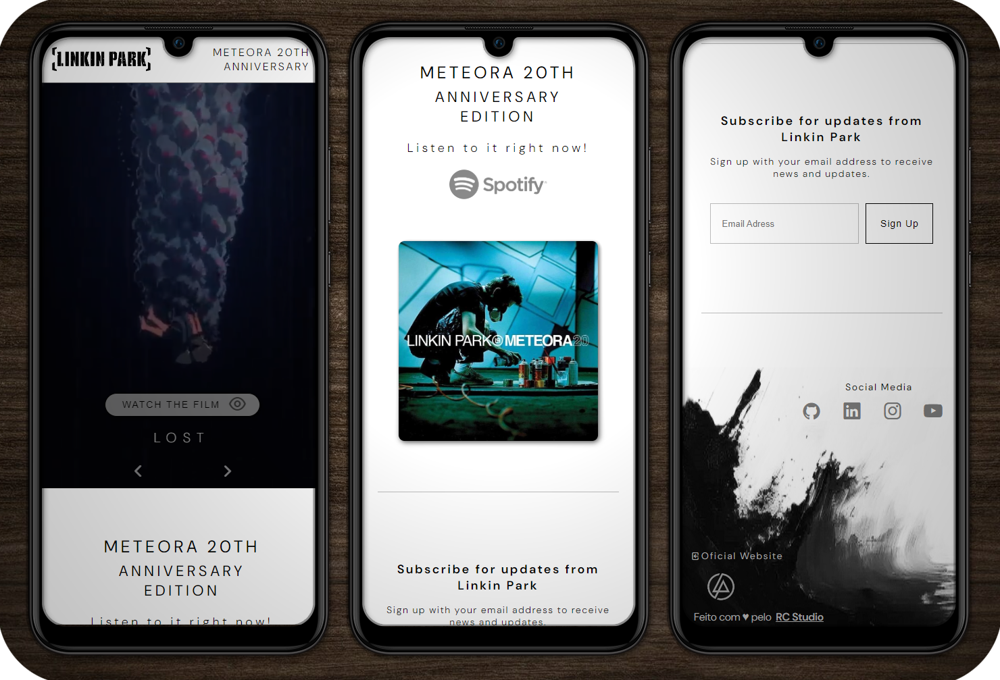

<h1 align="center"> Página Aniversário de 20 anos Meteora(Linkin Park) </h1>

Exercício para praticar HTML, CSS e Javascript   
<a href="https://renato-dilabio.github.io/Agregador-de-Links/">Link para contato</a>

  <a href="#-tecnologias">Tecnologias</a>&nbsp;&nbsp;&nbsp;|&nbsp;&nbsp;&nbsp;
  <a href="#-projeto">Projeto</a> 

 

  

## 🚀 Tecnologias

Esse projeto foi desenvolvido com as seguintes tecnologias:

- HTML e CSS
- JavaScript
- Git e Github

## 💻 Projeto

Projeto realizado como exercício para o curso de formação Front-End (Hora de Codar).

- [Acesse o projeto finalizado](https://renato-dilabio.github.io/Meteora20/)

- [Link do Curso](https://www.udemy.com/course/formacao-front-end-html-css-javascript-react-e/)

---

Feito com ♥ pelo RC Studio
